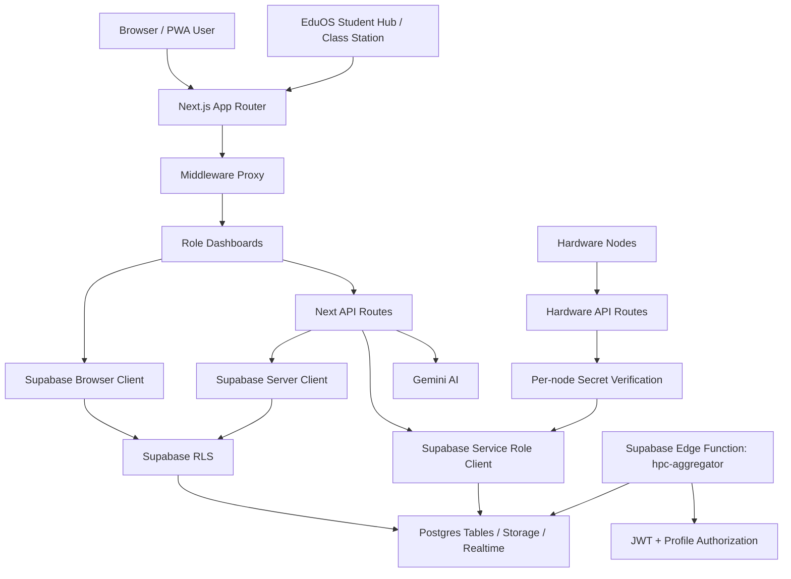
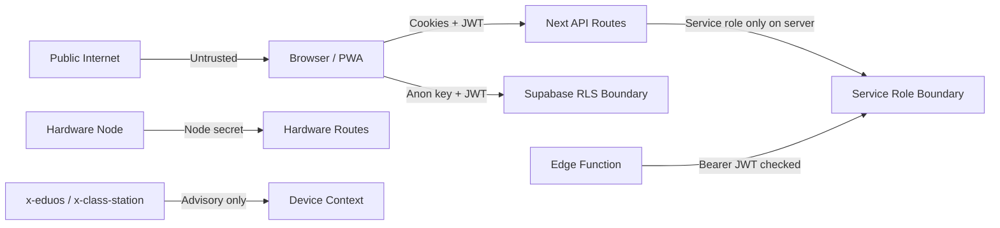

# EduPortal Advanced Web App Assessment

Date: 2026-05-01  
Workspace: `C:\Users\tecbu\OneDrive\Desktop\VSCODE\28042026\SCHOOL`  
Application: EduPortal / `eduportal-web`  
Stack: Next.js 16.2.4, React 19.2.5, TypeScript 6, Supabase, Gemini AI, PWA/EduOS

## 1. Executive Position

EduPortal is a multi-tenant education operations platform spanning cloud administration, school role dashboards, student kiosk workflows, AI academic tooling, realtime classroom monitoring, and hardware/EduOS lifecycle support.

The application now passes production build and lint execution after remediation. The most concrete issues from the first examination were patched, including stale integrations, missing dependencies, open QR session creation, unauthenticated HPC aggregation, weak request validation in several high-risk routes, unsafe service assumptions, and accessibility/PWA cache issues.

Current maturity level: advanced prototype / pre-production candidate.

The product architecture is strong enough to continue hardening. The next leap is not more feature breadth; it is trust-boundary discipline: signed device identity, full RLS verification, route smoke tests, and operational observability.

## 2. Remediation Completed

Completed in this pass:

- Restored dependencies with `npm install`.
- Verified `npm run build` passes.
- Verified `npm run lint` exits successfully with warnings only.
- Added shared in-memory route throttling in `src/lib/rate-limit.ts`.
- Applied rate limits to code login, registration requests, QR generation, AI generation, OCR, and vision grading.
- Protected QR generation with student-hub device context.
- Added stronger request validation for AI generation and hardware telemetry.
- Added AI grading response schema validation.
- Corrected stale `/api/ai/grade` usage to `/api/ai/vision-grade`.
- Corrected staff service school context handling.
- Replaced stale `school_profiles` usage with `schools.attendance_mode`.
- Added rollback cleanup for failed school/staff provisioning after auth-user creation.
- Hardened `hpc-aggregator` with bearer-token validation and tenant authorization.
- Improved hardware update checks with semantic version comparison.
- Improved service worker cache cleanup and GET-only caching.
- Removed viewport zoom blocking.
- Added schema migration `supabase/migrations/20260501_report_fixes.sql`.
- Updated `WEB_APP_REPORT.md` with remediation state.

## 3. Verification Snapshot

Commands executed:

```powershell
npm install
npm run lint
npm run build
```

Results:

- Install: passed; zero vulnerabilities reported by npm audit.
- Lint: passed with warnings only.
- Build: passed; Next.js generated all app routes successfully.

Known verification caveat:

- Local Node is `v25.9.0`; one transitive package reports an engine warning expecting Node 20/22/24. For deployment, standardize on the project’s intended Node LTS runtime.

## 4. System Architecture



Primary layers:

- Presentation: App Router pages and client dashboards.
- Access control: middleware role routing, API route role checks, Supabase RLS.
- Data: Supabase Postgres, Storage, Realtime, Edge Functions.
- AI: Gemini server-side API usage.
- Edge hardware: EduOS kiosk, telemetry, QR/gate flows, OTA update checks.

## 5. Trust Boundaries



Important distinction:

- Supabase auth JWT and service role are hard boundaries.
- RLS policies are hard boundaries if complete and correctly tested.
- `x-eduos`, `x-class-station`, and device cookies are currently soft boundaries. They help UX and flow gating, but can be spoofed unless added by trusted infrastructure or replaced with signed device identity.

## 6. Route Surface Matrix

| Area | Routes | Current Control | Maturity |
|---|---|---:|---:|
| Admin analytics/config/schools | `/api/admin/*` | `requireUser(["admin"])` | Strong |
| Public registration request | `POST /api/admin/requests` | Validation + rate limit | Medium |
| School provisioning | `/api/school/provision` | Admin + service role + rollback | Strong |
| Staff creation | `/api/school/staff/create` | Principal + service role + rollback | Strong |
| Code login | `/api/auth/code-login` | Rate limit + service role lookup + Supabase password auth | Medium |
| Gate token | `/api/auth/gate/token` | Station secret + short JWT | Medium |
| Gate login | `/api/auth/gate/login` | Signed short JWT + hardware binding check | Medium |
| QR generation | `/api/auth/qr/generate` | Student-hub context + rate limit | Medium |
| QR verification | `/api/auth/qr/verify` | Staff role + school ownership | Strong |
| AI generation | `/api/ai/generate` | Auth + rate limit + input validation + class-station gate | Medium |
| AI OCR/grading | `/api/ai/ocr`, `/api/ai/vision-grade` | Staff roles + class-station gate + image limits | Medium |
| Hardware telemetry/update | `/api/hardware/*` | Per-node secret | Strong |
| HPC aggregation | Supabase Edge Function | Bearer JWT + role/school authorization | Medium-Strong |

## 7. Data Model Assessment

Core tenant model:

- `schools.id` is the tenant identifier.
- `profiles.school_id` links users to tenants.
- Most school data tables must enforce `school_id` or student-school joins.
- Admin can operate globally.
- Principal/teacher/moderator should operate only inside their own school.
- Student should only access their own records plus allowed public school content.

Schema drift patched:

- Added `schools.plan_type`.
- Added `schools.attendance_mode`.
- Added `alumni` to `user_role`.

Critical tables for RLS audit:

- `profiles`
- `schools`
- `attendance`
- `hpc_grades`
- `hpc_competencies`
- `behavioral_logs`
- `materials`
- `syllabus`
- `announcements`
- `chat_rooms`
- `chat_messages`
- `chat_participants`
- `student_sessions`
- `device_commands`
- `support_tickets`
- `qr_sessions`
- `hardware_nodes`
- `fleet_releases`
- `fleet_deployments`
- `system_logs`

## 8. Security Risk Register

| ID | Risk | Severity | Status | Recommended Control |
|---|---|---:|---|---|
| R1 | Device headers/cookies can be spoofed | High | Open | Signed device tokens or per-node challenge auth for kiosk-only actions |
| R2 | RLS policy gaps can expose tenant data | High | Open | Table-by-table policy tests with positive/negative role fixtures |
| R3 | Public routes can be abused | Medium | Mitigated | Replace in-memory rate limit with Redis/Upstash/Supabase-backed limiter |
| R4 | AI prompt/output can drift from expected schema | Medium | Mitigated | Add strict schema library and output repair fallback |
| R5 | Edge Function service-role misuse | High | Patched | Keep auth checks; prefer Next wrapper for centralized audit |
| R6 | Auth/session cache in PWA kiosk mode | Medium | Partially mitigated | Add explicit kiosk logout cache purge and offline shell |
| R7 | Service-role provisioning partial writes | Medium | Patched | Add DB RPC transaction if possible |
| R8 | Lack of automated route tests | Medium | Open | Add smoke tests for all role boundaries |
| R9 | Sensitive logging metadata | Medium | Open | Redact rubrics/images/tokens and cap metadata size |
| R10 | Node runtime mismatch | Low | Open | Pin Node LTS in `.nvmrc`, Vercel/project settings, and README |

## 9. AI Governance Review

AI entry points:

- Assessment generation.
- OCR.
- Vision grading.
- HPC aggregation is analytics, not generative AI.

Controls added:

- Server-side Gemini key isolation.
- Role checks.
- Class-station context for assessment/grading actions.
- Rate limiting.
- Input limits.
- Response schema validation for grading.

Recommended next controls:

- Add per-school and per-user usage quotas.
- Store model name, prompt class, timestamp, user, school, and output hash for audit.
- Redact or avoid storing raw student images in logs.
- Add human-finalization requirement for grades.
- Add domain filters for topic generation.
- Add deterministic JSON schema validation for all AI endpoints, not only grading.

## 10. PWA / EduOS Readiness

Current strengths:

- Manifest exists.
- Service worker supports offline fallback and asset caching.
- EduOS standalone redirect exists.
- Student-hub and class-station flags are supported.
- Hardware telemetry and update-check APIs exist.

Patched:

- Old cache cleanup.
- GET-only cache logic.
- Safer navigation response caching.
- Viewport zoom accessibility issue.

Remaining:

- Add offline-specific student shell instead of caching authenticated dashboard HTML.
- Add kiosk logout that clears relevant caches.
- Use signed device identity before allowing exam/grading actions.
- Add service worker tests for offline and logout behavior.

## 11. Operational Readiness

Current:

- Build passes.
- Lint exits successfully.
- Supabase schema/migrations exist.
- EduOS deployment scripts exist.
- Hardware telemetry logs events.

Missing before production:

- Health check endpoint.
- Structured server logging with correlation IDs.
- Error monitoring.
- Route-level smoke tests.
- RLS regression tests.
- Backup/restore runbook.
- Environment variable inventory and validation.
- Deployment runtime pinning.
- Incident response playbook for school tenant data exposure.

## 12. Test Strategy

Recommended test pyramid:

1. Static:
   - TypeScript build.
   - ESLint with warnings tracked.
   - Migration syntax validation.

2. Unit:
   - Rate limiter behavior.
   - Version comparison.
   - AI response validators.
   - Device context helpers.

3. API:
   - Admin route rejects non-admin.
   - Principal cannot create staff outside allowed roles.
   - Student cannot call teacher/admin APIs.
   - QR verify rejects cross-school student.
   - Hardware telemetry rejects missing/wrong node secret.
   - AI routes reject oversized images and malformed body.

4. RLS:
   - Student can read own attendance only.
   - Teacher can read same-school students only.
   - Principal cannot read another school.
   - Moderator permissions match intended content scope.
   - Chat participants cannot join cross-tenant rooms.

5. Browser smoke:
   - Admin login/dashboard.
   - School staff login.
   - Student login.
   - Teacher AI generation.
   - Student PWA offline fallback.

## 13. Production Hardening Roadmap

### Phase 1: Security Closure

- Sign device identity for EduOS and class-station actions.
- Replace in-memory limiter with persistent limiter.
- Add environment validation at boot.
- Complete RLS regression suite.
- Add server-side audit events for admin mutations and AI usage.

### Phase 2: Reliability

- Add smoke tests in CI.
- Add route-level error monitoring.
- Add service worker logout/cache tests.
- Add migration deployment runbook.
- Add rollback plan for school/staff provisioning.

### Phase 3: Maintainability

- Remove unused imports and dead UI state.
- Fix hook dependency warnings.
- Convert critical `any` types to domain types.
- Move direct client mutations behind service modules or server routes where needed.
- Document app roles and permissions in `Project.md` or dedicated docs.

### Phase 4: Product Polish

- Improve empty/error/loading states.
- Add admin observability dashboards for AI usage and hardware health.
- Add school-level audit exports.
- Add kiosk onboarding and device rebind workflow.

## 14. File Change Summary

New files:

- `ADVANCED_WEB_APP_REPORT.md`
- `WEB_APP_REPORT.md`
- `src/lib/rate-limit.ts`
- `supabase/migrations/20260501_report_fixes.sql`

Notable modified files:

- `eslint.config.mjs`
- `public/sw.js`
- `src/app/layout.tsx`
- `src/app/api/auth/qr/generate/route.ts`
- `src/app/api/auth/code-login/route.ts`
- `src/app/api/admin/requests/route.ts`
- `src/app/api/ai/generate/route.ts`
- `src/app/api/ai/ocr/route.ts`
- `src/app/api/ai/vision-grade/route.ts`
- `src/app/api/hardware/telemetry/route.ts`
- `src/app/api/hardware/update-check/route.ts`
- `src/app/api/school/provision/route.ts`
- `src/app/api/school/staff/create/route.ts`
- `src/services/staff.service.ts`
- `src/services/logger.service.ts`
- `supabase/functions/hpc-aggregator/index.ts`
- `supabase/system.sql`

## 15. Final Assessment

EduPortal is now in a healthier technical state than the initial review found. The app builds, lint runs, the largest integration mismatches are fixed, and the riskiest open server paths have better controls.

The remaining work is clear and bounded: turn soft device context into cryptographic identity, prove RLS with tests, and add CI smoke coverage. Once those are in place, the platform can move from advanced prototype toward production pilot with much more confidence.
