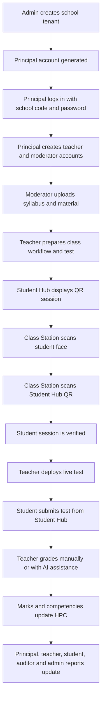
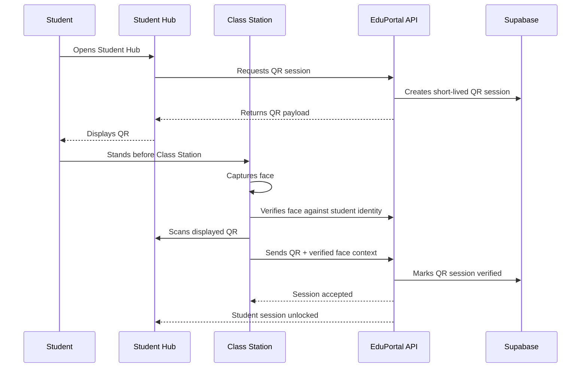
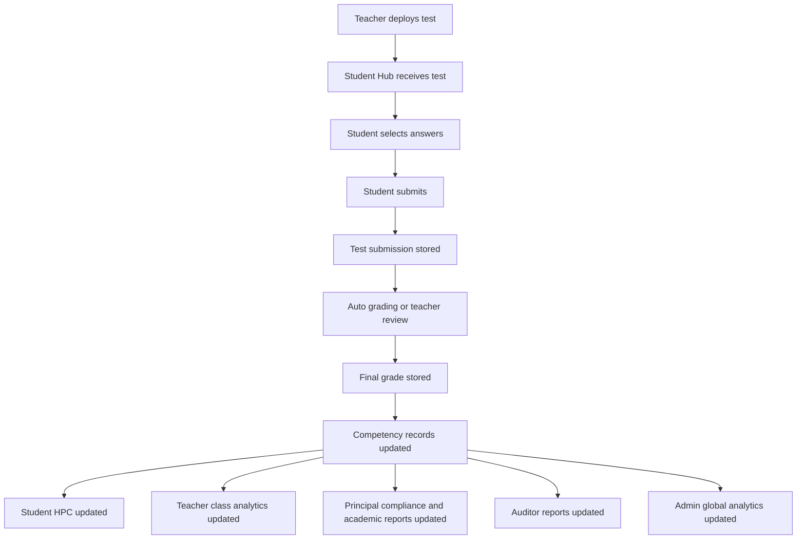

# EduPortal Detailed Working Report

Date: 2026-05-02  
Project: EduPortal Ecosystem  
Developed and managed by: Tecbunny Solutions Private Limited  
Project handled by: Co-founder Shubham Bhisaji  
Email: shubham@tecbunny.com  
Mobile: +91 7387375651  

## 1. Purpose of This Report

This document explains the end-to-end working of the EduPortal ecosystem from account creation to login, daily school operation, live test deployment, student test submission, grading, progress cards, and reports for every major user role.

The report is written as an operational flow document. It covers how each user enters the system, what data they create, how that data moves across the platform, and which reports become available after test completion and school activity.

## 2. Ecosystem Summary

EduPortal is a multi-tenant school operating system. It connects central administration, school leadership, teachers, students, auditors, AI assessment tools, and EduOS hardware devices into one connected workflow.

The system has three major layers:

| Layer | Surface | Purpose |
|---|---|---|
| Central Cloud Layer | Admin dashboard | Tenant onboarding, school lifecycle, subscriptions, fleet, analytics, logs, support, and global settings. |
| School Operations Layer | Staff Station | Principal/HOD, teacher, moderator, alumni, and school operations workflows. |
| Classroom Edge Layer | Student Hub and Class Station | Student learning desk, QR identity, face verification, live tests, offline material cache, and classroom telemetry. |

## 3. User Roles Covered

| User Role | Main Entry | Core Responsibility |
|---|---|---|
| Admin | `/admin` | Creates and manages schools, monitors platform health, controls global settings, reviews requests and analytics. |
| Principal / HOD | `/school/staff` then dashboard | Manages school operations, staff accounts, attendance policy, compliance, timetable, promotions, announcements, and reports. |
| Teacher | `/school/staff` then dashboard | Runs classroom activity, deploys tests, scans worksheets, grades submissions, views class analytics, and updates HPC data. |
| Moderator | `/school/staff` then dashboard | Uploads syllabus, manages learning material, prepares AI context, and controls content quality. |
| Student | `/school/student` or Student Hub | Uses Student Desk, views timetable/materials, receives live tests, submits answers, and views HPC progress. |
| Auditor | `/auditor` | Views compliance health, engagement reports, institutional analytics, and signed reports. |
| Alumni | `/school/dashboard/alumni` | Accesses alumni-facing school workspace where enabled. |
| Hardware Node | API + EduOS | Sends heartbeat, receives updates, binds to tenant, supports Student Hub and Class Station workflows. |

## 4. High-Level End-to-End Flow

## 5. Account Creation Lifecycle

### 5.1 Admin Account

The Admin is the platform-level user. Admin access is used to manage the overall EduPortal ecosystem. Admin login happens through the central admin portal.

Admin responsibilities:

- Login to the Central Intelligence dashboard.
- Review school registration requests.
- Provision new schools.
- Configure global platform settings.
- Monitor subscriptions and tenant status.
- Review global analytics.
- Monitor hardware fleet, logs, nodes, and releases.
- Control global promotion window and platform-level policies.

Admin authentication:

| Field | Description |
|---|---|
| System Identifier | Admin user code, such as `ADXXXXX`. |
| Security Key | Admin password. |
| Allowed Role | Only `admin`. |
| Destination After Login | `/admin/dashboard`. |

### 5.2 School / Tenant Creation

School creation is performed by the Admin through the provisioning workflow.

Technical route:

`POST /api/school/provision`

Required data:

| Field | Purpose |
|---|---|
| U-DISE code | 11-digit school identifier used to create a school tenant. |
| Principal name | Name of the first school administrator. |
| Initial password | Strong password for the principal account. |

Provisioning steps:

1. Admin submits U-DISE code, principal name, and password.
2. System validates that the U-DISE code is 11 digits.
3. System checks whether the school is already provisioned.
4. System creates a new record in the `schools` table.
5. System creates a principal user in Supabase Auth using a generated internal email.
6. System creates a matching `profiles` record with role `principal`.
7. System returns the generated principal login code.

Generated principal example:

| Item | Example Pattern |
|---|---|
| School code | `SCHXXXX` |
| Principal code | `PRXXXX01` |
| Role | `principal` |
| School binding | Principal profile is linked to the school tenant ID. |

Failure handling:

- If Auth user creation fails, the school record is rolled back.
- If profile creation fails, the Auth user and school record are rolled back.
- This prevents half-created tenants.

### 5.3 Principal / HOD Account

The Principal/HOD account is created during school provisioning. It is the first school-level account and controls staff creation and school operations.

Principal account data:

| Field | Source |
|---|---|
| Full name | Provided by Admin during school provisioning. |
| User code | Generated by provisioning API. |
| Password | Initial password set during provisioning. |
| Role | `principal`. |
| School ID | Linked to the created school tenant. |

Principal can:

- Create teacher accounts.
- Create moderator accounts.
- Configure attendance mode.
- View school analytics.
- Manage announcements.
- Manage support tickets.
- Generate compliance reports.
- Run promotion workflow when global window is open.
- View HOD snapshots.

### 5.4 Teacher and Moderator Account Creation

Teacher and Moderator accounts are created by the Principal/HOD from the staff management interface.

Technical route:

`POST /api/school/staff/create`

Allowed requester:

Only a logged-in `principal`.

Allowed created roles:

| Role | Allowed |
|---|---|
| Teacher | Yes |
| Moderator | Yes |
| Student | No, not through this route |
| Admin | No |
| Auditor | No |

Staff creation steps:

1. Principal opens Add Staff.
2. Principal enters staff full legal name.
3. Principal selects role: Teacher or Moderator.
4. System verifies principal session and school tenant.
5. System generates a unique login ID.
6. System generates a temporary password.
7. System creates Auth user silently on the backend.
8. System creates the staff profile.
9. System binds the staff member to the principal's school.
10. System returns the login ID and temporary password.

Generated staff login pattern:

| Role | Login ID Pattern |
|---|---|
| Teacher | `TCH-{school-prefix}-{random}` |
| Moderator | `MOD-{school-prefix}-{random}` |

Returned credential details:

| Field | Description |
|---|---|
| Staff Member | Full name entered by principal. |
| Login ID | Generated staff code. |
| Role | Teacher or Moderator. |
| Temporary Password | Auto-generated secure password. |

Security behavior:

- Staff account creation uses the service role only on the server.
- The principal never creates Auth users directly from the browser.
- Staff accounts are bound to the same `school_id` as the principal.
- If profile creation fails, the generated Auth user is deleted.

### 5.5 Student Account Creation

Student accounts exist as `profiles` with role `student` and are bound to:

- A school tenant.
- A class.
- Student identity information.
- Attendance records.
- HPC grades.
- Competency metrics.
- Student Hub sessions.

The current application provides the Student Hub and student dashboard surfaces. In a full deployment, student accounts can be created through one of the following controlled flows:

| Flow | Description |
|---|---|
| Bulk import | School uploads student roster and system creates student profiles. |
| Admin / principal provisioning | School leadership creates students during onboarding. |
| SIS migration | Student records migrate from an existing school ERP. |
| Device-bound activation | Student profile is linked to Student Hub during first session. |

Recommended production behavior:

- Generate student login codes similar to staff codes.
- Bind every student to `school_id`, `class_id`, and optionally `student_roll_no`.
- Require principal-approved roster import.
- Avoid open public self-registration for students.

### 5.6 Auditor Account

Auditor accounts are used for external or internal compliance review.

Auditor can:

- Access auditor dashboard.
- View compliance health map.
- Generate signed reports.
- Review engagement, attendance, HPC, and institutional health summaries.

Auditor should not:

- Modify grades.
- Create staff.
- Change school settings.
- Trigger promotions.
- Change hardware configuration.

## 6. Login and Access Control Flow

### 6.1 Code-Based Login

EduPortal uses a code-based login pattern for users.

Technical route:

`POST /api/auth/code-login`

Login body:

| Field | Description |
|---|---|
| `code` | User code such as admin code, principal code, teacher code, moderator code, or student code. |
| `password` | Security key / password. |
| `allowedRoles` | Optional role filter used by the portal. |
| `schoolCode` | Optional school binding check for school users. |

Login steps:

1. User enters system identifier and security key.
2. System normalizes the user code to uppercase.
3. System checks rate limit for login attempts.
4. Service client looks up the user profile by `user_code`.
5. System validates role against the requested login portal.
6. If school code is supplied, system verifies the user's school.
7. System fetches the internal Auth email for the profile.
8. System signs in with Supabase Auth.
9. System returns session and user profile.
10. UI redirects by role.

Role routing:

| Role | Dashboard Route |
|---|---|
| Admin | `/admin/dashboard` |
| Auditor | `/auditor/dashboard` |
| Principal | `/school/dashboard/hod` |
| Teacher | `/school/dashboard/teacher` |
| Moderator | `/school/dashboard/moderator` |
| Student | `/school/dashboard/student` |
| Alumni | `/school/dashboard/alumni` |

### 6.2 School Gateway

The school gateway lets the user choose the correct workspace.

Available workspaces:

| Workspace | Users |
|---|---|
| Staff Station | Principal, teacher, moderator, school staff. |
| Student Hub | Students on browser/PWA or EduOS Student Hub. |

If EduOS simulation or EduOS cookie is detected, the gateway redirects to the Student Hub surface.

## 7. Device Architecture and Identity Flow

EduPortal uses two separate classroom devices.

| Device | Board | Camera | Main Purpose |
|---|---|---|---|
| Student Hub | Luckfox Pico Ultra W | No camera | Student desk, QR display, live test, study material, HPC. |
| Class Station | Luckfox Pico Ultra BW | Has camera | Face scan, QR scan, teacher station, class cache, AI/OCR workflows. |

### 7.1 Student Hub

Student Hub is the learner-facing device. It does not include a camera. This improves privacy because the student desk does not continuously capture visual data.

Student Hub responsibilities:

- Show student dashboard.
- Display QR session.
- Receive live test broadcast.
- Allow answer selection.
- Submit answers.
- Show study materials.
- Show timetable and announcements.
- Show HPC progress.
- Send session heartbeat.

### 7.2 Class Station

Class Station is the classroom-facing trusted station. It has a camera and handles scanning flows.

Class Station responsibilities:

- Scan student face.
- Scan QR shown on Student Hub.
- Confirm student-device-session match.
- Support teacher classroom workflows.
- Support OCR and worksheet scanning.
- Support AI grading from scanned work.
- Cache classroom materials locally.
- Trigger AI workflows from controlled station context.

### 7.3 Face + QR Login Flow

The desired classroom identity flow is:

Important privacy design:

- Student Hub has no camera.
- Camera is centralized on Class Station.
- Face scan happens only at station-level verification.
- QR binds the physical Student Hub session to the verified student identity.

## 8. Daily Working Flow by User

### 8.1 Admin Daily Flow

Admin workflow:

1. Admin logs in from `/admin`.
2. Admin reaches central dashboard.
3. Admin reviews registration requests.
4. Admin provisions schools when approved.
5. Admin checks school list, school details, users, subscription status, analytics, logs, nodes, and fleet.
6. Admin can update global configuration and global promotion window.
7. Admin reviews platform-level support or operational requests.

Admin report outputs:

| Report / View | Purpose |
|---|---|
| Global analytics | Total schools, students, papers, pending requests. |
| School list | Tenant status and lifecycle view. |
| Subscription status | Tracks license or plan status. |
| Fleet dashboard | Hardware node health and update readiness. |
| System logs | Operational and error traceability. |
| Snapshots | Platform-level snapshots for monitoring. |

### 8.2 Principal / HOD Daily Flow

Principal/HOD workflow:

1. Principal logs in from Staff Station.
2. Principal lands on HOD dashboard.
3. Principal checks attendance compliance and school statistics.
4. Principal creates teacher or moderator accounts if required.
5. Principal configures attendance mode.
6. Principal publishes announcements.
7. Principal reviews CPD progress.
8. Principal reviews compliance report card.
9. Principal opens support ticket if platform support is needed.
10. Principal runs promotion console when the admin global switch permits it.

Principal reports:

| Report | Data Source | Purpose |
|---|---|---|
| NEP 2020 Compliance Card | Attendance, CPD, safety, syllabus coverage | School compliance review. |
| HOD Snapshots | School analytics and operational data | Leadership dashboard snapshot. |
| Attendance Summary | Attendance table | Tracks daily and subject-wise compliance. |
| Staff CPD Report | CPD logs | Tracks teacher development hours. |
| Promotion Readiness | Promotion service and student records | Checks academic year rollover readiness. |

### 8.3 Moderator Daily Flow

Moderator workflow:

1. Moderator logs in from Staff Station.
2. Moderator opens content management dashboard.
3. Moderator uploads or updates syllabus.
4. Moderator structures curriculum into machine-readable form.
5. Moderator uploads study materials.
6. Moderator marks content for AI indexing where required.
7. Student Hub and Class Station can cache materials for offline use.
8. Teacher AI generation uses moderator-approved content as grounding context.

Moderator outputs:

| Output | Purpose |
|---|---|
| Syllabus records | AI and teacher context. |
| Material library | Student study hub and offline resources. |
| Indexed content | Enables better question generation and retrieval. |
| Subject filters | Helps students and teachers find material by subject. |

### 8.4 Teacher Daily Flow

Teacher workflow:

1. Teacher logs in from Staff Station.
2. Teacher opens teacher dashboard.
3. Teacher checks connected students and class status.
4. Teacher uses classroom tools to prepare lesson/test activity.
5. Teacher can generate assessment content with AI.
6. Teacher deploys live test to the class room realtime channel.
7. Teacher monitors classroom participation.
8. Teacher reviews submissions or scanned worksheets.
9. Teacher uses Split-Screen Grader and AI suggestions if needed.
10. Teacher finalizes marks and feedback.
11. Final marks contribute to HPC grades and competency metrics.

Teacher reports:

| Report / View | Purpose |
|---|---|
| Class Analytics | Class-level performance and engagement. |
| Live Monitor Grid | Student Hub connection/session status. |
| Pending Grading | Work that still requires teacher action. |
| Grading Panel | Manual and AI-assisted evaluation. |
| HPC Contribution | Competency impact from graded work. |

### 8.5 Student Daily Flow

Student workflow:

1. Student opens Student Hub.
2. Student identity is verified through Class Station face scan + Student Hub QR.
3. Student reaches Student Desk.
4. Student views ongoing session, timetable, and announcements.
5. Student opens study materials from Study Hub.
6. Student waits for a live test broadcast when teacher starts an assessment.
7. Student answers questions on Student Hub.
8. Student submits final answers before timer ends.
9. Student sees submission confirmation.
10. Student later views marks, mastery, and HPC progress.

Student reports:

| Report / View | Purpose |
|---|---|
| Student Desk | Daily session, timetable, announcements. |
| Study Hub | Subject material and offline cache status. |
| Live Test Completion | Confirms assessment submission. |
| Holistic Progress Card | Academic, socio-emotional, physical, and vocational progress. |
| Attendance Rate | Attendance history summary. |
| Average Grade | Performance from graded work. |

### 8.6 Auditor Daily Flow

Auditor workflow:

1. Auditor logs in through auditor portal.
2. Auditor opens compliance dashboard.
3. Auditor views compliance health map.
4. Auditor reviews institutional metrics.
5. Auditor generates signed reports.
6. Auditor checks monthly or yearly compliance status.

Auditor reports:

| Report | Purpose |
|---|---|
| Full Academic Year Audit | Complete annual institutional review. |
| Monthly Compliance Snapshot | Month-level compliance and performance view. |
| Staff Performance Report | Teaching staff and CPD overview. |
| Secure Signed Report | Watermarked audit output for inspection. |

## 9. Live Test Working Flow

### 9.1 Test Preparation

Test creation can be manual or AI-assisted.

Teacher preparation sources:

- Moderator-approved syllabus.
- Uploaded material.
- Teacher context prompt.
- Class and subject.
- Rubric or question pattern.

AI generation route:

`POST /api/ai/generate`

AI controls:

- Requires authenticated staff.
- Uses rate limiting.
- Validates input.
- Intended to run from controlled classroom/staff context.

### 9.2 Test Deployment

The student live test engine listens to Supabase Realtime broadcasts.

Realtime channel:

`class_room_{classId}`

Broadcast event:

`DEPLOY_TEST`

Live test payload:

| Field | Description |
|---|---|
| `title` | Test title shown to student. |
| `subject` | Subject name. |
| `durationMinutes` | Timer duration. |
| `questions` | List of objective questions. |
| `question.id` | Question identifier. |
| `question.question` | Question text. |
| `question.options` | Options shown to student. |

### 9.3 Student Receives Test

When teacher deploys the test:

1. Student Hub receives `DEPLOY_TEST`.
2. Live Test Engine opens automatically.
3. Timer starts.
4. Questions and options render on Student Hub.
5. Student selects answers.
6. Student is warned not to close app or lock screen.

Student Hub restriction:

- The live test screen is only active on Student Hub.
- If opened outside Student Hub, the UI shows "Student Hub Device Required".

### 9.4 Student Submission

Submission process:

1. Student taps Submit Final Draft.
2. System starts syncing state.
3. Student answers are prepared for storage.
4. UI confirms assessment completion.
5. Student can return to hub.

Current implementation note:

- The current `LiveTestEngine` has the complete student-side UX, timer, answer collection, realtime receive flow, and completion screen.
- The current submission handler simulates database submission with a delay.
- Production should persist answers into a dedicated submissions table.

Recommended production submission tables:

| Table | Purpose |
|---|---|
| `tests` | Stores test header, subject, duration, class, teacher, school. |
| `test_questions` | Stores question text, options, correct answer, marks, competency tag. |
| `test_sessions` | Stores deployment instance, start time, end time, class, status. |
| `test_submissions` | Stores student submission, submitted time, device ID, score status. |
| `test_answers` | Stores each answer selected by the student. |

Recommended submission record:

| Field | Description |
|---|---|
| `id` | Submission ID. |
| `school_id` | Tenant isolation. |
| `test_session_id` | Live test deployment instance. |
| `student_id` | Student profile. |
| `student_hub_node_id` | Device used for submission. |
| `class_station_node_id` | Station that verified session. |
| `answers_json` | Student answers. |
| `submitted_at` | Timestamp. |
| `auto_submitted` | True if timer expired. |
| `status` | Submitted, graded, returned, disputed. |

### 9.5 Auto Submit on Timer End

If timer reaches zero:

1. Live Test Engine detects `timeLeft === 0`.
2. Submit handler is called automatically.
3. Student work is marked complete.
4. UI shows completion status.

Recommended production behavior:

- Save incremental draft answers every few seconds.
- Save local offline draft if network drops.
- On timer end, submit last synced draft.
- Mark as `auto_submitted = true`.
- Record device heartbeat and connectivity status.

## 10. Grading and Evaluation Flow

### 10.1 Objective Test Grading

For objective live tests:

1. Teacher deploys MCQ or objective test.
2. Student answers from Student Hub.
3. System stores answers.
4. System compares answers with answer key.
5. System calculates score.
6. Teacher can review exceptions or manually adjust.
7. Final score goes to `hpc_grades`.
8. Competency metrics update `hpc_competencies`.

### 10.2 Worksheet / Subjective Grading

Teacher uses Split-Screen Grader for scanned worksheets.

Workflow:

1. Teacher opens grading panel.
2. Teacher scans worksheet using Class Station camera.
3. Scanned image appears on the left panel.
4. Teacher clicks AI suggestion or scanner triggers AI grading.
5. Image is sent to `/api/ai/vision-grade`.
6. Gemini extracts text and returns evaluation suggestions.
7. Teacher reviews suggested score and feedback.
8. Teacher adjusts scores manually if required.
9. Teacher writes personalized feedback.
10. Teacher submits and finalizes grade.

Rubric example:

| Criterion | Purpose |
|---|---|
| Conceptual clarity | Understanding of topic. |
| Linguistic accuracy | Language and expression. |
| Presentation and flow | Cleanliness and structure. |

Important rule:

AI can suggest. Teacher finalizes.

### 10.3 HPC Integration

After grades are finalized:

| Data | Destination |
|---|---|
| Marks | `hpc_grades` |
| Competency score | `hpc_competencies` |
| Feedback | Grade feedback / report remarks |
| Skill evidence | Skill or vocational metric where applicable |
| Attendance relation | Attendance and engagement analytics |

HPC categories:

- Academic achievement.
- Socio-emotional pulse.
- Physical and vocational development.
- Vocational skill map.
- Attendance and participation indicators.

## 11. Report Generation and Visibility

### 11.1 Student Reports

Student reports are visible from the Student Hub dashboard.

Student report components:

| Component | Details |
|---|---|
| Holistic Progress Card | Shows NEP 2020 aligned 360-degree evaluation. |
| Academic Achievement | Competency-based academic mastery. |
| Socio-Emotional Pulse | Collaboration, empathy, and peer interaction. |
| Physical and Vocational | Health, sports, and skill acquisition. |
| Vocational Skill Map | Bagless day / internship progress. |
| Attendance Rate | Derived from attendance records. |
| Average Grade | Derived from HPC grades. |
| Material Status | Cached/offline-ready study files. |

Student report data sources:

- `attendance`
- `hpc_grades`
- `hpc_competencies`
- `materials`
- `timetable`
- `announcements`
- `skill metrics`

### 11.2 Teacher Reports

Teacher report components:

| Component | Details |
|---|---|
| Connected students | Count of students linked to school/class. |
| Pending grading | Count of grade records requiring completion. |
| Class health snapshot | Academic, socio-emotional, and physical mastery aggregate. |
| Live monitor | Student Hub heartbeat and activity view. |
| AI grading result | Extracted text, feedback, suggested marks. |
| Final grade sheet | Teacher-approved marks and comments. |

Teacher report data sources:

- `profiles`
- `student_sessions`
- `hpc_grades`
- `hpc_competencies`
- `cpd_logs`
- `attendance`

### 11.3 Principal / HOD Reports

Principal/HOD report components:

| Component | Details |
|---|---|
| Attendance Compliance | Current day or policy-based attendance health. |
| Syllabus Coverage | Coverage status from moderator and teacher activity. |
| Teacher CPD Hours | Average professional development hours. |
| Safety Audit | School safety compliance status. |
| Academic Performance Analytics | Competency distribution across grades. |
| Institutional Health Pulse | Infrastructure, sanitation, and compliance view. |
| Staff Competency Log | Staff development summary. |

Report generation:

- The Compliance Report Generator aggregates school stats.
- It can produce a printable audit view.
- The report is intended for board inspections and annual institutional reviews.

### 11.4 Admin Reports

Admin report components:

| Component | Details |
|---|---|
| Total schools | Count of provisioned tenants. |
| Total students | Count of student profiles. |
| Total papers | Count of generated or stored papers. |
| Pending requests | Count of school registration requests. |
| Fleet status | Hardware node health and update status. |
| System logs | Platform activity and errors. |
| Subscription status | Plan and license tracking. |

Admin report data sources:

- `schools`
- `profiles`
- `exam_papers`
- `registration_requests`
- `hardware_nodes`
- `fleet_deployments`
- `system_logs`

### 11.5 Auditor Reports

Auditor report types:

| Report Type | Description |
|---|---|
| Full Academic Year Audit | Complete school-year compliance and academic review. |
| Monthly Compliance Snapshot | Month-level compliance status. |
| Staff Performance Report | Staff performance and CPD review. |
| Secure Signed Report | Cryptographically signed, watermarked PDF-style report. |

Auditor review areas:

- Attendance compliance.
- HPC progress.
- Engagement heatmap.
- Institutional performance.
- Staff development.
- Safety and school health.

## 12. Data Flow From Test to Reports

## 13. Database and Storage Areas

Important current tables and intended responsibilities:

| Table | Responsibility |
|---|---|
| `profiles` | Central identity for all users, including role and school binding. |
| `schools` | Tenant metadata, school code, school name, plan, settings. |
| `attendance` | Daily or subject-wise attendance records. |
| `hpc_grades` | Marks and teacher grading records. |
| `hpc_competencies` | NEP competency and mastery metrics. |
| `materials` | Uploaded study material and cache/index status. |
| `syllabus` | Curriculum structure and AI grounding context. |
| `announcements` | School announcements shown to students/staff. |
| `student_sessions` | Student Hub heartbeat and live session monitoring. |
| `qr_sessions` | QR login/session verification records. |
| `hardware_nodes` | Student Hub and Class Station registration and heartbeat. |
| `fleet_releases` | EduOS release versions. |
| `fleet_deployments` | OTA deployment status per hardware node. |
| `support_tickets` | HOD/admin support workflow. |
| `system_logs` | Operational event logging. |
| `cpd_logs` | Teacher professional development hour records. |

Recommended additions for complete test submission persistence:

| Table | Reason |
|---|---|
| `tests` | Store assessment metadata. |
| `test_questions` | Store questions/options/answer key. |
| `test_sessions` | Store each deployment of a test to a class. |
| `test_submissions` | Store student test-level submission. |
| `test_answers` | Store question-level answers. |
| `test_audit_events` | Store start, sync, submit, auto-submit, reopen, and grading events. |

## 14. Security and Tenant Isolation

Current security controls:

| Control | Purpose |
|---|---|
| Role-based route access | Users reach only role-appropriate dashboards. |
| Code login role filters | Prevents wrong portal login. |
| School code verification | Ensures user belongs to selected school. |
| Supabase Auth | Provides session authentication. |
| Service role server-only use | Sensitive user creation happens on backend. |
| RLS policies | Database tenant isolation. |
| Rate limiting | Protects login, QR, registration, and AI routes. |
| Hardware node secrets | Protects hardware telemetry and update checks. |
| QR session verification | Binds Student Hub session to classroom verification. |

Recommended production security controls:

- Signed Student Hub identity token.
- Signed Class Station identity token.
- Device challenge-response instead of header-only device checks.
- Full RLS test suite for every table.
- Immutable audit log for test lifecycle.
- Encrypted storage for sensitive student evidence.
- Redaction for AI logs and scanned worksheet data.
- Parent/student consent model for face verification.

## 15. Hardware-Assisted Classroom Flow

### 15.1 Before Class

1. Student Hub boots EduOS.
2. Student Hub opens locked PWA shell.
3. Student Hub sends heartbeat.
4. Class Station boots EduOS.
5. Class Station sends heartbeat.
6. Both devices check for updates.
7. Study materials are cached if available.

### 15.2 During Class

1. Student Hub displays student session QR.
2. Student stands before Class Station.
3. Class Station scans student face.
4. Class Station scans QR from Student Hub.
5. System verifies student identity and device session.
6. Teacher starts class activity.
7. Student receives class tools, study notes, or live test.

### 15.3 During Test

1. Teacher deploys test.
2. Student Hub receives test.
3. Student answers.
4. Timer counts down.
5. Student submits or auto-submit happens.
6. Submission is synced.
7. Teacher sees submission status.

### 15.4 After Test

1. Teacher reviews objective or subjective answers.
2. AI can assist with OCR or rubric suggestions.
3. Teacher finalizes marks.
4. HPC updates.
5. Reports update for student, teacher, principal, auditor, and admin.

## 16. User-Wise Report Access Matrix

| Report / Data | Admin | Principal/HOD | Teacher | Moderator | Student | Auditor |
|---|---:|---:|---:|---:|---:|---:|
| Global school count | Yes | No | No | No | No | Yes, if granted |
| School staff list | Yes | Yes | Limited | No | No | View-only if granted |
| Student list | Yes | Yes | Class-limited | No | No | View-only |
| Attendance report | Yes | Yes | Class-limited | No | Own summary | Yes |
| Live test status | No/optional | Yes | Yes | No | Own test only | Optional |
| Test submission | No/optional | Yes | Yes | No | Own submission | View-only |
| Grade sheet | No/optional | Yes | Yes | No | Own grade | View-only |
| HPC report | Aggregate | School aggregate | Class/student | No | Own HPC | Aggregate/view-only |
| CPD report | Aggregate | Yes | Own CPD | Own CPD | No | Yes |
| Content library | Yes | Yes | Yes | Yes | Read-only | View-only |
| Compliance report | Yes | Yes | Limited | No | No | Yes |
| Hardware fleet | Yes | School devices | Class devices | No | Assigned hub status | View-only |
| System logs | Yes | Limited support logs | No | No | No | View-only if granted |

## 17. Report Lifecycle After Student Test Submission

After a test is submitted, the reporting chain should update in this order:

1. Submission confirmation: Student sees completion screen.
2. Submission record: System stores student answers and timestamp.
3. Teacher queue: Submission appears in teacher grading/pending review.
4. Auto scoring: Objective answers are scored automatically.
5. Manual review: Teacher reviews subjective or flagged answers.
6. AI assistance: Teacher may use OCR and AI grading suggestion.
7. Finalization: Teacher submits final grade and feedback.
8. HPC update: Academic and competency metrics update.
9. Student report: Student HPC and grade view refresh.
10. Class report: Teacher class analytics refresh.
11. School report: Principal compliance and academic report refresh.
12. Audit report: Auditor can generate updated report.
13. Admin analytics: Platform aggregate counts refresh.

## 18. Current Implementation Status

Implemented or present:

- Admin login and dashboard surfaces.
- School provisioning API.
- Principal account creation during provisioning.
- Principal staff creation API for teachers and moderators.
- Code-based login with role checks.
- Role-based dashboard routing.
- Student Hub dashboard surface.
- Student Desk with timetable and announcements.
- Study Hub with material listing and offline-ready indicators.
- Live Test Engine with realtime receive, timer, answer selection, submit button, auto-submit trigger, and completion state.
- Teacher Split-Screen Grader.
- Worksheet scanner and AI grading route.
- HPC Viewer for student progress.
- Compliance report generator for HOD.
- Auditor report generator.
- Hardware handshake, telemetry, and update-check routes.
- QR generation and verification routes.
- EduOS hardware model for Student Hub and Class Station.

Known gap to close for complete production test submission:

- Live test student submission currently simulates database persistence.
- A production-ready submission database flow should be added using `test_submissions` and `test_answers`.
- Teacher deployment UI should persist test definitions and broadcast from stored test sessions.
- Auto grading should write directly to grade draft records before teacher finalization.

## 19. Recommended Production Completion Checklist

Account and identity:

- Add full student roster import.
- Add student login code generation.
- Add parent/guardian contact fields if required.
- Add first-login password reset for staff and students.
- Add account disable/suspend workflow.

Test submission:

- Add `tests`, `test_questions`, `test_sessions`, `test_submissions`, and `test_answers`.
- Save draft answers periodically.
- Support offline draft cache on Student Hub.
- Add auto-submit reason and device heartbeat snapshot.
- Add teacher review status.
- Add grade finalization history.

Reports:

- Generate downloadable student HPC PDF.
- Generate class-level test result PDF/CSV.
- Generate principal academic report PDF.
- Generate auditor signed report PDF.
- Add report ID, generated by, generated at, school ID, and hash.

Security:

- Replace soft device headers with signed device identity.
- Add full audit event trail for account creation and tests.
- Add RLS tests for every table.
- Add per-school AI quota.
- Add storage lifecycle policy for scanned worksheets.

Operations:

- Add production health endpoint.
- Add structured logs with correlation IDs.
- Add backup and restore runbook.
- Add incident response policy for student data.
- Add monitoring for hardware fleet heartbeat failure.

## 20. Conclusion

EduPortal provides a connected working model for the complete school journey: school onboarding, principal creation, staff provisioning, student device workflow, classroom verification, live tests, teacher grading, AI support, HPC generation, compliance review, and platform-level reporting.

The strongest product idea is the combination of cloud school operations with two classroom devices:

- Student Hub without camera for safer student desk usage.
- Class Station with camera for centralized face verification and classroom scanning.

This design keeps the student interface focused while allowing secure classroom identity, test delivery, worksheet scanning, and report generation. The remaining technical priority is to make live test submission fully persistent in the database and connect that submission record directly into grading, HPC, and downloadable reports.
