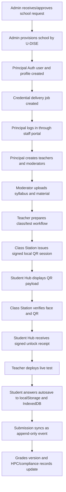

# EduPortal Detailed Working Report (Technical)

Date: 2026-05-02  
Project: EduPortal Ecosystem  
Developed and managed by: Tecbunny Solutions Private Limited  
Project handled by: Co-founder Shubham Bhisaji  
Email: shubham@tecbunny.com  
Mobile: +91 7387375651  

## 1. Current System Summary

EduPortal is a multi-tenant school operating system built with Next.js, React, TypeScript, Supabase, Gemini AI, and EduOS classroom hardware. The current implementation connects cloud administration, school staff workflows, student learning surfaces, assessment workflows, AI-assisted grading, audit reporting, and classroom edge devices.

The latest codebase includes major hardening for credential delivery, offline test continuity, local classroom QR authority, signed hardware requests, APAAR/ABC-linked student identity, grade versioning, hub distribution, and realtime authorization.

## 2. Runtime Stack

| Area | Current Implementation |
|---|---|
| Frontend | Next.js 16.2.4 App Router, React 19.2.5, TypeScript 6 |
| Backend | Next.js route handlers under `src/app/api` |
| Database/Auth | Supabase Auth, Postgres, RLS policies, Edge Function |
| AI | Google Gemini through `@google/generative-ai` |
| Charts/UI | Recharts, Chart.js, lucide-react |
| QR/device flows | `qrcode.react`, `html5-qrcode`, EduOS local station routes |
| Hardware image | `eduos` image payload, edge server, kiosk scripts |

## 3. Architecture Layers

| Layer | Main Surfaces | Responsibility |
|---|---|---|
| Central Cloud Layer | Admin dashboard, admin APIs, Supabase | Tenant creation, school lifecycle, analytics, requests, subscriptions, fleet, settings |
| School Operations Layer | Staff portal, HOD/principal/teacher/moderator dashboards | Staff management, attendance rules, timetable, material, grading, reports, promotions |
| Student Layer | Student portal, Student Desk, Study Hub, Live Test Engine, HPC viewer | Learning, test taking, offline recovery, progress viewing |
| Classroom Edge Layer | Student Hub, Class Station, EduOS local APIs | QR authority, face verification, local cache, telemetry, update checks, hub checkout |
| Audit/Compliance Layer | Auditor dashboard, compliance features, migrations | Compliance health, engagement analytics, report generation, immutable audit direction |

## 4. User Roles and Entry Points

| Role | Entry Point | Current Capability |
|---|---|---|
| Admin | `/admin` and `/admin/dashboard` | Provision schools, manage requests, view schools, subscriptions, analytics, logs, fleet, nodes, settings |
| Principal/HOD | `/school/staff`, `/school/dashboard/hod` | Create staff, manage attendance policy, timetable, announcements, promotions, snapshots, compliance |
| Teacher | `/school/dashboard/teacher` | Classroom tools, worksheet scanning, split-screen grading, live monitor, class analytics |
| Moderator | `/school/dashboard/moderator` | Syllabus and learning material management |
| Student | `/school/student`, `/school/dashboard/student` | Student Desk, Study Hub, live tests, HPC viewer, EduOS hub flow |
| Auditor | `/auditor`, `/auditor/dashboard` | Compliance health map and report generation |
| Alumni | `/school/dashboard/alumni` | Alumni-facing school workspace |
| Hardware Node | `/api/hardware/*`, `/api/local/qr/*` | Handshake, signed telemetry, signed updates, face verification, local QR sessions |

## 5. End-to-End Flow

## 6. School Provisioning

School creation is handled by `POST /api/school/provision`.

Current behavior:

- Validates the U-DISE code as 11 digits.
- Rejects duplicate provisioned schools.
- Creates a school record.
- Generates a principal login code.
- Creates the principal in Supabase Auth with a backend-generated temporary credential.
- Creates a principal profile bound to the school tenant.
- Inserts a `credential_delivery_jobs` record.
- Returns only non-secret provisioning metadata: school details, principal code, and credential delivery status.

Important security behavior:

- Plaintext passwords are not returned to the browser.
- Human-entered initial passwords are not accepted for principal provisioning.
- The first credential is backend-generated and must be delivered through a secure channel or reset-link process.
- Supabase Auth creation and database writes are treated as separate operations that require idempotent jobs and compensating cleanup if production delivery fails mid-flow.

## 7. Staff Account Creation

Teacher and moderator accounts are created through `POST /api/school/staff/create`.

Current behavior:

- Only a principal can create staff.
- Allowed roles are teacher and moderator.
- Created accounts are bound to the principal's `school_id`.
- Temporary credentials are generated server-side.
- The Add Staff UI exposes only non-secret login metadata.
- Temporary credentials are not returned to the browser and should be delivered through secure SMS/email/reset-link infrastructure.

This closes the earlier credential leakage risk where temporary passwords could be copied from the browser response.

## 8. Authentication and Access Control

Primary login route:

- `POST /api/auth/code-login`

Current controls:

- Rate-limits login attempts.
- Requires system identifier and security key.
- Enforces portal-specific role access.
- Enforces school binding for school-scoped logins.
- Rejects invalid credentials with generic messaging.

Deprecated cloud QR routes:

- `/api/auth/qr/generate`
- `/api/auth/qr/verify`

These endpoints now return `410 Gone` because classroom unlock must not depend on cloud QR verification during an internet outage. The active QR flow is the local Class Station authority.

## 9. Local Classroom QR Authority

Active routes:

- `POST /api/local/qr/session`
- `POST /api/local/qr/verify`

Core library:

- `src/lib/local-station-qr.ts`

Current behavior:

- Class Station creates a signed QR envelope containing session ID, device ID, nonce, station ID, issue time, and expiry time.
- Sessions are stored in local station state under `.eduos-local/qr-sessions.json` unless overridden by `EDUOS_LOCAL_STATE_DIR`.
- QR payloads are HMAC-signed using `EDUOS_STATION_SIGNING_SECRET`.
- Verification requires a successful face verification signal before unlock.
- Replay is rejected because verified/expired sessions cannot be reused.
- Successful verification returns a signed unlock receipt.
- Supabase is treated as deferred audit/sync storage, not as the runtime dependency for classroom unlock.

Production requirements:

- Each Class Station should have a unique signing secret or hardware-backed key.
- Student Hubs should trust enrolled station public keys or pinned station credentials.
- Local session state should be persisted on durable storage with safe file permissions.
- Unlock receipts should be synchronized into cloud audit logs when connectivity returns.

## 10. Live Test Engine

Main files:

- `src/features/student-portal/LiveTestEngine.tsx`
- `src/lib/live-test-vault.ts`
- `src/app/api/sync/events/route.ts`

Current behavior:

- Answers are autosaved immediately.
- State is mirrored in `localStorage` for fast recovery.
- State is also written to IndexedDB through `eduportal-live-test-vault`, making recovery stronger after tab refresh, PWA suspend, process kill, or low-memory device pressure.
- Question and option ordering can be randomized per student.
- Final submit retries in the background with jitter to reduce synchronized classroom load.
- Test payloads carry server-issued `startsAt` and `endsAt` deadlines.
- Submissions include timing metadata such as `submitted_at`, `ends_at`, timer status, and late seconds.
- Sync validation requires exam submissions to include a server-issued `ends_at` timestamp.

Design rule:

The Student Hub timer is a user interface convenience. The authoritative deadline must be enforced by the backend or Class Station using server/station-issued timing data.

## 11. Offline-First Event Sync

Main route:

- `POST /api/sync/events`

Migration:

- `supabase/migrations/20260502_append_only_events.sql`

Current behavior:

- Accepts event batches with a batch size limit.
- Requires at least one event.
- Ensures events are synced only for the authenticated actor.
- Ensures school-scoped events match the actor's school.
- Validates exam submission timing metadata.
- Stores ordered append-only events instead of relying only on direct state updates.

Purpose:

- Preserve student/exam/attendance/grade/device actions during offline or unstable connectivity.
- Reduce overwrite conflicts by syncing facts/events.
- Support later projections into reports, submissions, answers, HPC, and audit tables.

## 12. Realtime Test Broadcast Hardening

Migration:

- `supabase/migrations/20260502_credential_delivery_and_realtime_rls.sql`

Current direction:

- Live test delivery must avoid predictable public topics like class-wide room names.
- Student Hubs subscribe to private per-school, per-class, per-student topics.
- Supabase Realtime policies should allow only the intended authenticated student to receive the relevant broadcast.

This reduces the risk of students guessing channel names and receiving another class or student's test payload.

## 13. APAAR / ABC Student Identity

Route:

- `POST /api/students/apaar-link`

Migration:

- `supabase/migrations/20260502_abc_apaar_enrollments.sql`

Current behavior:

- Links an existing student profile to an APAAR/ABC identity.
- Uses the `link_student_profile_to_apaar` database function.
- Separates long-lived student identity from school enrollment.

Why it matters:

- Student transfer history can be represented cleanly.
- Alumni state can preserve earlier school membership.
- HPC/progress history can follow the learner rather than being trapped in one school's profile record.

## 14. Grade Versioning

Migration:

- `supabase/migrations/20260502_grade_versioning.sql`

Current behavior:

- Grade writes use version counters.
- Newer grade decisions win by logical version rather than device clock time.
- This protects against Class Station clock drift, resets, or bad local timestamps.

Design rule:

Teacher/Class Station grade origin remains authoritative, but conflict resolution should use server-validated logical ordering and audit records.

## 15. Hardware Trust and Telemetry

Main routes:

- `POST /api/hardware/register-key`
- `POST /api/hardware/telemetry`
- `POST /api/hardware/update-check`
- `POST /api/hardware/face-verify`
- `POST /api/hardware/handshake`

Main library:

- `src/lib/hardware-auth.ts`

Migration:

- `supabase/migrations/20260502_hardware_signatures_face_embeddings.sql`

Current controls:

- Hardware nodes can register Ed25519 public keys.
- Sensitive hardware requests require signed headers: node ID, timestamp, nonce, and signature.
- The signed canonical payload includes method, path, body hash, timestamp, and nonce.
- Nonces are inserted into `hardware_request_nonces`; duplicate nonce inserts are treated as replay attempts.
- Telemetry validates temperature, battery, network, storage, and uptime ranges.
- Update checks are signed and respect maintenance-window behavior for routine updates.

Remaining production hardening:

- Enforce timestamp freshness in addition to nonce uniqueness.
- Protect private keys in device secure storage where available.
- Add fleet key rotation and revoke compromised nodes.
- Move any development fallback secrets out of production images.

## 16. Face Verification

Route:

- `POST /api/hardware/face-verify`

Current behavior:

- Requires signed hardware request authentication.
- Accepts compact numeric face embeddings instead of video streams.
- Requires student ID, embedding model, and numeric embedding.
- Validates threshold range.
- Ensures the node cannot verify a student outside its school.
- Returns verification result and similarity.

This keeps camera responsibility on the Class Station and reduces bandwidth compared with streaming raw video from Student Hubs.

## 17. Hub Distribution Mode

Main file:

- `src/features/hardware/HubDistributionMode.tsx`

Migration:

- `supabase/migrations/20260502_hub_distribution_mode.sql`

Current workflow:

- Teacher/Class Station can pair a recognized student with a physical Student Hub.
- The checkout records which student holds which hub.
- End-of-class flow can lock checked-out hubs and return them to a signed-out state.

This supports high-speed classroom distribution where devices are shared across periods.

## 18. AI Workflows

Routes:

- `POST /api/ai/generate`
- `POST /api/ai/ocr`
- `POST /api/ai/vision-grade`

Current controls:

- AI routes are rate-limited.
- Students cannot generate full exam papers.
- OCR and grading validate image size and required input fields.
- Vision grading requires a rubric.
- Gemini configuration must exist before calls proceed.

Recommended next step:

AI generation should use RAG-style retrieval over vetted syllabus/material chunks rather than sending full PDFs or unbounded classroom content to the model.

## 19. Admin and School Operations

Admin API routes:

- `GET /api/admin/analytics`
- `GET/PATCH /api/admin/config`
- `GET/POST/PATCH /api/admin/requests`
- `GET/PATCH /api/admin/schools`
- `GET/PATCH /api/admin/schools/[id]`
- `POST /api/admin/schools/batch`

School operations features:

- Attendance configuration
- Staff creation and teacher list
- Timetable manager
- Promotion console
- Announcements
- Support ticket system
- Offline health dashboard
- Compliance report generator

The platform now has both high-level administrative control and daily school workflow surfaces.

## 20. EduOS Hardware Architecture

EduOS uses two device profiles:

| Device | Recommended Board | Purpose |
|---|---|---|
| Student Hub | Luckfox Pico Ultra W | Student desk kiosk, no camera, locked PWA, tests, study material, QR display, offline shell |
| Class Station | Luckfox Pico Ultra BW | Classroom station, camera workflows, QR authority, face verification, local cache, telemetry, orchestration |

Shared platform:

- Rockchip RV1106 family.
- ARM Cortex-A7 class CPU.
- Integrated NPU capability suitable for lightweight edge inference.
- eMMC storage on Ultra series.
- Display, USB, Ethernet, and camera interface support depending on board profile.

Relevant files:

- `eduos/build-eduos.ps1`
- `eduos/scripts/kiosk-engine.sh`
- `eduos/image_payload/app/server.js`
- `eduos/image_payload/app/public/sw.js`
- `eduos/edge-server/docker-compose.yml`
- `eduos/installer/deploy-to-sd.ps1`

## 21. Database and Migration Map

| Migration | Purpose |
|---|---|
| `20260501_report_fixes.sql` | Report-related fixes |
| `20260501_security_loophole_fixes.sql` | Earlier security and RLS fixes |
| `20260502_abc_apaar_enrollments.sql` | APAAR/ABC student identity and enrollment model |
| `20260502_append_only_events.sql` | Offline-first append-only event sync |
| `20260502_credential_delivery_and_realtime_rls.sql` | Secure credential delivery jobs and Realtime policy hardening |
| `20260502_grade_versioning.sql` | Logical grade versions |
| `20260502_hardware_signatures_face_embeddings.sql` | Hardware signatures, request nonces, face embeddings |
| `20260502_hub_distribution_mode.sql` | Hub checkout/distribution workflow |

## 22. Current Verification Status

Previously recorded verification in the workspace says:

- TypeScript passed with `npx tsc --noEmit`.
- Lint passed with only existing warnings.
- Production build passed with `npm run build`.
- Smoke checks passed for `/admin/provision`, `/school/student`, and deprecated QR endpoint behavior.
- Local QR authority accepted one signed session and rejected replay.

These checks should be rerun after any report-generation or code changes before a production demo.

## 23. Current Risk Register

| Priority | Risk | Current State | Required Next Step |
|---|---|---|---|
| High | Credential delivery | Jobs exist, browser no longer receives secrets | Integrate real SMS/email/reset provider and delivery audit |
| High | Auth/database partial failure | Documented as non-atomic | Complete idempotent provisioning job runner and verified cleanup |
| High | Offline exam projection | Append-only sync exists | Ensure projections into `test_submissions`, `test_answers`, HPC, and audit tables are durable |
| High | Device key protection | Signed requests exist | Add timestamp freshness, rotation, revocation, secure storage |
| High | Local QR trust | Signed local QR exists | Replace shared HMAC with per-station keys for production |
| Medium | AI context control | AI endpoints are rate-limited | Add RAG chunk retrieval and source-bound generation |
| Medium | Immutable compliance logs | Reports exist | Stream critical events to WORM-capable external audit storage |
| Medium | EduOS kiosk hardening | Image/scripts exist | Lock compositor escape paths, debug ports, and reset behavior |

## 24. Conclusion

The current EduPortal codebase is no longer only a web dashboard. It now contains the core pieces of a school operating platform: tenant provisioning, role-based portals, staff management, AI-assisted assessment, offline-first test recovery, append-only sync, local classroom QR authority, signed hardware requests, face embedding verification, APAAR/ABC learner identity, hub distribution, and EduOS deployment assets.

The next engineering focus should be productionizing delivery and trust boundaries: secure credential delivery, provisioning compensation, durable event projections, station key management, immutable audit export, and fully hardened EduOS kiosk deployment.
