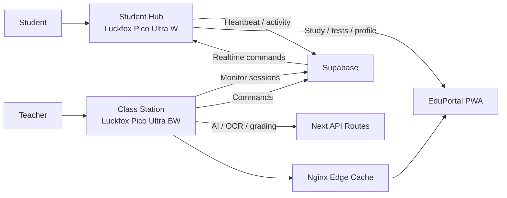
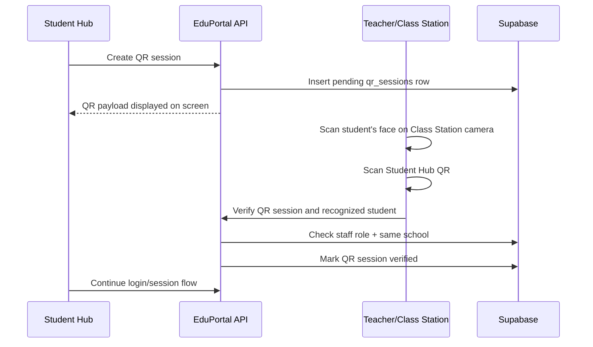
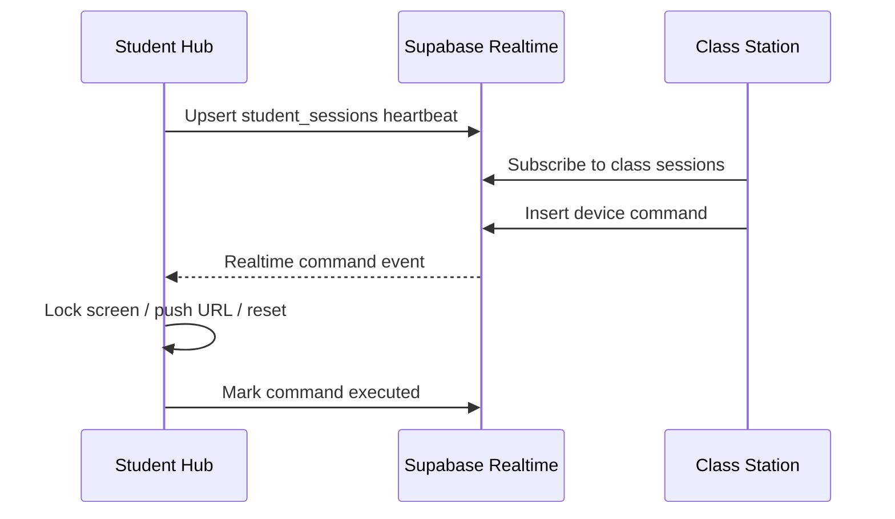

# EduOS Two-Device Hardware Architecture

Date: 2026-05-01  
Project: EduPortal / EduOS  
Architecture: Separate Student Hub and Class Station devices  
Build Signature: `1.0.0-SSPH01`

## 1. Hardware Decision

EduOS should use two distinct physical device profiles:

1. **Student Hub**
   - A personal or desk-level student kiosk.
   - Optimized for locked-down learning, tests, study material, student identity, and offline use.
   - No camera.

2. **Class Station**
   - A classroom-level teacher/edge node.
   - Optimized for local caching, camera/vision workflows, QR/identity workflows, worksheet scanning, telemetry, teacher orchestration, and classroom control.
   - Has camera.

Recommended board baseline:

- Student Hub: **Luckfox Pico Ultra W**
- Class Station: **Luckfox Pico Ultra BW**

Reason:

- Student Hub benefits from Wi-Fi/Bluetooth mobility and does not need camera hardware.
- Class Station benefits from fixed wired/PoE-style deployment while retaining wireless fallback.
- Both remain in the same Luckfox Pico Ultra / RV1106 ecosystem, reducing OS and driver fragmentation.

Official references:

- [Luckfox Pico RV1106 Wiki](https://wiki.luckfox.com/Luckfox-Pico-RV1106/)
- [Luckfox Pico Ultra product page](https://www.luckfox.com/EN-Luckfox-Pico-Ultra)
- [Luckfox Pico Ultra W Wiki](https://wiki.luckfox.com/Luckfox-Pico-Ultra)
- [Rockchip RV1106 overview](https://rockchips.net/product/rv1106/)
- [Rockchip RV1106 brief datasheet PDF](https://www.rock-chips.com/uploads/pdf/2022.8.26/192/RV1106%20Brief%20Datasheet.pdf)

## 2. Device Overview

| Device | Recommended Board | Deployment | Primary User | Main Purpose |
|---|---|---|---|---|
| Student Hub | Luckfox Pico Ultra W | Student desk / lab terminal | Student | Locked-down PWA, tests, study, QR login, offline shell, no camera |
| Class Station | Luckfox Pico Ultra BW | Teacher desk / wall / classroom node | Teacher / school | Student QR scanning, face verification, camera capture, local cache, scan station, telemetry, orchestration |

## 3. Shared SoC Platform

Both devices stay on the Rockchip RV1106 family.

Shared technical traits:

- CPU: single-core ARM Cortex-A7 32-bit processor with NEON and FPU.
- MCU: integrated RISC-V MCU.
- NPU: INT4 / INT8 / INT16 hybrid quantization support.
- NPU class: approximately 0.5 TOPS on RV1106G2 and up to 1 TOPS on RV1106G3 variants.
- ISP: 5MP class image signal processor.
- Camera: MIPI CSI 2-lane support on Luckfox Ultra series.
- Display: RGB666 / DPI interface.
- Ethernet: 10/100M Ethernet controller and embedded PHY.
- USB: USB 2.0 Host/Device.
- Storage: 8GB eMMC on Ultra series.

## 4. Device 1: Student Hub

### 4.1 Purpose

The Student Hub is the locked-down student-facing EduOS device.

Primary workflows:

- Student login.
- Shows QR handshake session for Class Station scan.
- Study material viewing.
- Live tests and quizzes.
- Student dashboard.
- Holistic Progress Card viewing.
- Offline PWA fallback.
- Student heartbeat and current activity reporting.

### 4.2 Recommended Board

**Luckfox Pico Ultra W**

Why:

- Wi-Fi 6 and Bluetooth 5.2/BLE support student-desk flexibility.
- No camera reduces cost, enclosure complexity, power draw, and student privacy risk.
- RGB666 display support fits a touch kiosk.
- eMMC storage supports local app/cache payloads.
- Same RV1106 family as Class Station.

### 4.3 Student Hub Minimum BOM

- 1x Luckfox Pico Ultra W.
- 1x 4-inch or larger RGB666 capacitive touch display.
- 1x stable 5V power supply.
- 1x protective enclosure.
- Wi-Fi access.

### 4.4 Student Hub Recommended BOM

- 1x Luckfox Pico Ultra W.
- 1x 4-inch 720x720 IPS capacitive touch display.
- 1x speaker or buzzer for exam/status alerts.
- 1x tamper-resistant enclosure.
- 1x stable 5V power supply.
- Optional Ethernet/PoE adapter if the classroom supports wired desks.

### 4.5 Student Hub Software

Relevant repo files:

- `eduos/scripts/kiosk-engine.sh`
- `public/sw.js`
- `next.config.ts`
- `src/app/school/dashboard/student/page.tsx`
- `src/features/student-portal/*`
- `src/lib/device-context.ts`

Runtime stack:

- Linux.
- Weston compositor.
- `cog` or Chromium kiosk browser.
- EduPortal PWA.
- Service worker offline cache.
- Student session heartbeat.

### 4.6 Student Hub Network Behavior

Cloud sync:

- Supabase auth/session.
- Student profile.
- Assignments/materials.
- Attendance/test state.
- Device heartbeat.

Local/offline behavior:

- Load cached student dashboard shell.
- Load cached app assets.
- Load cached materials where available.
- Queueing writes is not yet fully implemented and should be added before true offline production use.

### 4.7 Student Hub Security

Current controls:

- Student dashboard route protection.
- Hardware binding by `mac_address` / `is_hardware_bound`.
- Student-hub device context through `x-eduos` / `is-eduos`.
- QR session generation now requires student-hub context and rate limiting.

Required production hardening:

- Replace spoofable headers/cookies with signed device identity.
- Store node secret outside browser-accessible storage.
- Add kiosk escape prevention at compositor/browser level.
- Add physical tamper control for reset/debug ports.
- Add forced logout and cache purge when device is reassigned.

### 4.8 Student Hub Validation Checklist

- [ ] Device boots without keyboard/mouse.
- [ ] Touch display works.
- [ ] Wi-Fi auto-connects.
- [ ] Student dashboard opens in kiosk mode.
- [ ] Address bar and OS shell are inaccessible.
- [ ] QR login flow starts.
- [ ] QR is visible on Student Hub screen for Class Station scanning.
- [ ] Student heartbeat appears in teacher live grid.
- [ ] Offline shell loads after network disconnect.
- [ ] Hardware binding rejects another student if bound.
- [ ] Telemetry reaches server.
- [ ] Device can be revoked and re-enrolled.

## 5. Device 2: Class Station

### 5.1 Purpose

The Class Station is the classroom-level edge and teacher device.

Primary workflows:

- Local cache and classroom gateway.
- Teacher dashboard access.
- Student Hub QR scanning.
- Student face verification.
- Worksheet/document scanning.
- AI assessment/grading trigger.
- Live monitor grid orchestration.
- Push URL / lock screen commands.
- Hardware telemetry and update management.

### 5.2 Recommended Board

**Luckfox Pico Ultra BW**

Why:

- Suitable for fixed classroom installation.
- Keeps Wi-Fi/Bluetooth fallback.
- Better fit for PoE/wired deployment patterns.
- Supports camera and display.
- Same RV1106 software family as Student Hub.

### 5.3 Class Station Minimum BOM

- 1x Luckfox Pico Ultra BW.
- Ethernet connection.
- Stable power or PoE path.
- Enclosure.
- Optional display if operating headless through teacher browser.

### 5.4 Class Station Recommended BOM

- 1x Luckfox Pico Ultra BW.
- Ethernet/PoE preferred.
- 1x MIPI CSI camera for QR/identity, worksheet capture, or classroom vision workflows.
- Optional second camera for document scanning/classroom view.
- 1x 4-inch display for local status.
- 1x speaker/buzzer for status.
- 1x larger enclosure with ventilation.
- Optional local maintenance button hidden inside enclosure.

### 5.5 Class Station Software

Relevant repo files:

- `eduos/edge-server/nginx.conf`
- `eduos/edge-server/docker-compose.yml`
- `eduos/edge-server/Dockerfile`
- `eduos/build-eduos.ps1`
- `src/app/school/dashboard/teacher/page.tsx`
- `src/components/school/LiveMonitorGrid.tsx`
- `src/features/grading/*`
- `src/app/api/ai/*`
- `src/app/api/hardware/*`

Runtime stack:

- Linux.
- Nginx edge cache.
- Next.js standalone app or upstream proxy.
- Teacher dashboard.
- Optional kiosk browser.
- Hardware telemetry agent.

### 5.6 Class Station Network Behavior

Preferred:

- Wired Ethernet.
- PoE power/network for wall or teacher-desk station.

Responsibilities:

- Add `x-class-station` only from trusted local runtime or future signed identity.
- Cache app/materials with Nginx.
- Relay classroom workflows to cloud APIs.
- Monitor student session heartbeats.
- Issue device commands through Supabase realtime tables.

### 5.7 Class Station Security

Current controls:

- Teacher/principal/moderator role checks.
- Class-station context required for AI generation/OCR/vision grading.
- Hardware telemetry/update routes use per-node secret.
- QR verification checks staff role and same-school student ownership.

Required production hardening:

- Signed class-station identity.
- Per-device enrollment and revocation.
- Local admin password or hardware maintenance mode.
- Secure update verification using checksums/signatures.
- No shared class-station secret across all schools.

### 5.8 Class Station Validation Checklist

- [ ] Ethernet works.
- [ ] PoE path works if used.
- [ ] Nginx cache starts.
- [ ] Next.js standalone app starts.
- [ ] Teacher dashboard opens.
- [ ] `x-class-station` is only injected by trusted station runtime.
- [ ] AI generation works from teacher workflow.
- [ ] OCR/vision grading accepts camera capture.
- [ ] Live monitor grid receives student hub heartbeats.
- [ ] Lock screen command reaches Student Hub.
- [ ] Push URL command reaches Student Hub.
- [ ] Telemetry reaches server.
- [ ] Update check receives correct release.
- [ ] Device can be revoked and re-enrolled.

## 6. Student Hub vs Class Station Responsibilities



## 7. Interaction Flow

### 7.1 QR Login Flow

Expected classroom flow:

1. Student opens the Student Hub login screen.
2. Student Hub requests a QR session and displays the QR on-screen.
3. Class Station camera scans the student's face.
4. Class Station scans the QR displayed on the Student Hub.
5. Teacher/Class Station verifies that the face-recognized student matches the selected/student identity.
6. EduPortal marks the QR session verified.
7. Student Hub completes login.



### 7.2 Live Classroom Control Flow



## 8. Display Strategy

Student Hub:

- Recommended: 4-inch 720x720 IPS capacitive touch.
- Purpose: dashboard, tests, study material, login, progress card.
- Avoid 480x480 unless the student UI is simplified.

Class Station:

- Recommended: optional 4-inch display for local status only.
- Main teacher UI can run on teacher laptop/browser.
- If used for scanning, attach larger display or operate through teacher workstation.

## 9. Camera Strategy

Student Hub:

- No camera.
- Student-side privacy is simpler because all camera capture is centralized at the Class Station.
- QR login uses the Student Hub screen to display a QR session.
- The Class Station camera scans the student's face and then scans the QR shown on the Student Hub.

Class Station:

- Camera strongly recommended.
- Use for student face verification, Student Hub QR scanning, worksheet scanning, and document capture.
- 5MP wide-angle or adjustable document camera preferred.

## 10. Network Strategy

Student Hub:

- Wi-Fi-first.
- Ethernet optional for labs.
- Must tolerate intermittent connection with cached shell.

Class Station:

- Ethernet/PoE-first.
- Wi-Fi fallback.
- Should remain online as the classroom anchor node.

## 11. Hardware API Mapping

| API | Student Hub | Class Station |
|---|---:|---:|
| `/api/hardware/handshake` | Yes | Yes |
| `/api/hardware/telemetry` | Yes | Yes |
| `/api/hardware/update-check` | Yes | Yes |
| `/api/auth/qr/generate` | Yes | No |
| `/api/auth/qr/verify` | No | Yes, after face scan + QR scan |
| `/api/auth/gate/token` | No | Yes, if station acts as gate |
| `/api/auth/gate/login` | Yes, after station-issued token | Optional |
| `/api/ai/generate` | No, except restricted student study usage if later added | Yes |
| `/api/ai/ocr` | No | Yes |
| `/api/ai/vision-grade` | No | Yes |

## 12. Device Identity Model

Both devices need separate identities.

Student Hub identity:

- `nodeId`
- `student_id` binding.
- `school_id`
- `device role = student_hub`
- hardware secret/private key.

Class Station identity:

- `nodeId`
- `school_id`
- optional `class_id`
- `device role = class_station`
- hardware secret/private key.

Recommended database shape:

```text
hardware_nodes
- id
- school_id
- role: student_hub | class_station | identity_gate
- assigned_profile_id
- node_secret_hash
- status
- last_heartbeat
- version
- metadata
```

## 13. Procurement Recommendation

Buy separately:

### Student Hub Kit

- Luckfox Pico Ultra W.
- 4-inch 720x720 touch display.
- 5V power adapter.
- Student-safe enclosure.

### Class Station Kit

- Luckfox Pico Ultra BW.
- Ethernet/PoE setup.
- MIPI camera/document camera.
- Optional small status display.
- Ventilated enclosure.
- UART adapter for maintenance.

## 14. Pilot Quantity Recommendation

For one classroom pilot:

- 1x Class Station.
- 10-30x Student Hubs depending on class size.
- 2x spare Student Hubs.
- 1x spare Class Station.
- 1x UART debug kit.
- Spare displays and Class Station camera ribbon cables.

## 15. Final Recommendation

Use a two-device EduOS architecture:

- **Student Hub:** Luckfox Pico Ultra W.
- **Class Station:** Luckfox Pico Ultra BW.

This separates student-facing kiosk needs from classroom infrastructure needs while keeping all camera and vision capability centralized on the Class Station. That gives the project cleaner roles, lower Student Hub cost, easier privacy handling, easier provisioning, better security boundaries, and a practical deployment model for real classrooms.
