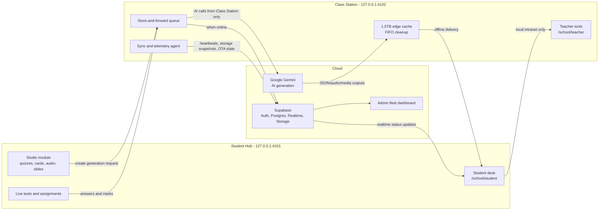

# EduPortal And EduOS Hybrid Edge Architecture

Last updated: 2026-05-04

EduPortal is a school operations and learning platform designed for classrooms where internet access is useful but cannot be assumed. EduOS provides the edge deployment model: a Class Station operates as the classroom gateway, while Student Hubs work as intranet-only clients. The architecture keeps daily school workflows local first, then synchronizes validated records to Supabase and cloud AI providers whenever the Class Station has connectivity.

## Goals

- Keep classroom teaching, live tests, assignments, grading, study material, and student self-service usable during internet outages.
- Allow AI-assisted workflows without giving Student Hubs outbound internet access.
- Preserve school data sovereignty through tenant-scoped rows, signed hardware requests, append-only offline events, and controlled cloud sync.
- Give admins visibility into Class Station health, storage pressure, software rollout status, and sync backlog.

## Runtime Topology

## Hardware Roles

### Class Station

- Local route: `http://127.0.0.1:4102/school/teacher`.
- Owns classroom internet access, cloud sync, AI provider calls, local queue processing, and local asset serving.
- Runs Teacher tools for paper generation, worksheet grading, OCR-assisted feedback, and class analytics.
- Maintains an edge cache with a target capacity of 1.5TB. When the storage pressure threshold is crossed, the cleanup worker deletes the oldest cached day first and records the result in `edge_storage_snapshots`.
- Authenticates to platform APIs as a signed hardware node using the existing hardware key and nonce flow.

### Student Hub

- Local route: `http://127.0.0.1:4101/school/student`.
- Has no outbound internet path. It communicates only with the Class Station over the local intranet.
- Runs the Student desk, assignments, study material, live tests, Studio generation UI, and holistic progress cards.
- Receives generated asset status through local station relay and Supabase realtime when available, but never calls external AI providers directly.

## Studio Generation Workflow

The Studio module turns notes and study materials into audio overviews, flashcards, quizzes, and slide decks.

1. The Student Hub creates a request against the local station API.
2. The Class Station validates the user/session and inserts a `public.generations` row with `status = 'pending'`.
3. The queue worker claims pending jobs by school, priority, and creation time, then sets `status = 'processing'`.
4. The Class Station calls Gemini or another configured provider. Assessment-class outputs must remain Class Station gated.
5. Generated JSON and media files are stored in the edge cache. Durable object metadata is written to `public.generation_assets`.
6. The generation row is marked `completed` with `output_payload`, `completed_at`, and asset references.
7. Student Hub clients subscribed to the relevant generation receive the status update and render from the cached asset endpoint.

Failures stay local and retryable. Each row tracks `attempt_count`, `max_attempts`, `error_code`, and `error_message`; failed rows can be retried by the station worker until the limit is reached.

Implemented API surface:

- `GET /api/studio/generations`: lists recent generation jobs for the current student, teacher, or principal.
- `POST /api/studio/generations`: creates a pending Studio job.
- `POST /api/eduos/generations/claim`: lets a Class Station claim the next pending school job.
- `POST /api/eduos/generations/{id}/processing`: marks a claimed job as actively processing.
- `POST /api/eduos/generations/{id}/complete`: stores completion payload and optional asset manifest rows.
- `POST /api/eduos/generations/{id}/fail`: records a failed job with retry-visible error metadata.

## Database Contracts

The migration `20260504053854_generation_queue_edge_cache.sql` adds:

- `public.generations`: queued AI jobs with tenant, requester, station, status, provider, retry, and output metadata.
- `public.generation_assets`: generated asset manifest rows pointing to edge-cache paths, Supabase Storage objects, or external objects.
- `public.edge_storage_snapshots`: periodic disk telemetry and FIFO cleanup state for Class Stations.

All three tables have RLS enabled. Students can create and view their own generation requests. Teachers and principals can manage school generation work. Admins can manage all rows. Asset and storage snapshot visibility remains school-scoped.

## Assessment Sync

Live tests and exams run from the Class Station even when the campus internet is offline.

- Student answers are appended as offline events and ordered by device Lamport clocks.
- Test submissions include server-issued timing metadata. The sync route normalizes late/on-time status before persistence.
- When internet returns, the Class Station pushes answer sheets, marks, and performance events to Supabase.
- Centralized records then power OCR grading, progress cards, class analytics, and auditor reporting.

## Fleet Monitoring

Class Stations are semi-autonomous nodes and must be observable from admin operations.

- Existing `hardware_nodes` rows hold node identity, type, current status, version, disk, memory, temperature, and heartbeat state.
- `fleet_releases` and `fleet_deployments` describe OTA rollouts and installation status.
- `edge_storage_snapshots` adds cache pressure and FIFO cleanup visibility.
- Admin pages should summarize node health, last sync, failed generation counts, disk pressure, and mandatory update state.

## Security Model

- Student Hubs do not receive AI provider keys or service-role credentials.
- External AI calls originate from the Class Station or trusted server contexts only.
- Public Supabase tables use RLS and school isolation helpers.
- Hardware APIs use signed requests and replay-protected nonces.
- Generated assets should use signed local URLs or short-lived cloud URLs; cache paths are metadata, not public authorization.
- Service-role operations remain server-side and must never be exposed through `NEXT_PUBLIC_` variables.

## Implementation Phases

1. Queue foundation: apply the generation queue migration and add server helpers for inserting, claiming, completing, and failing jobs.
2. Student Studio UI: add request creation and realtime status rendering inside the Student desk.
3. Class Station worker: add a local worker that processes pending rows, calls Gemini, writes assets, and updates statuses.
4. Edge asset server: expose cached assets through authenticated local endpoints with checksum validation.
5. Fleet dashboard: surface queue depth, failed jobs, storage pressure, and cleanup history in Admin fleet views.
6. Offline hardening: add replay tests, sync conflict tests, and browser checks for Student Hub and Class Station routes.
